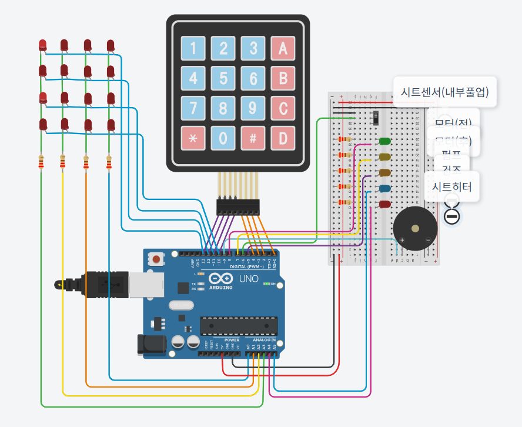
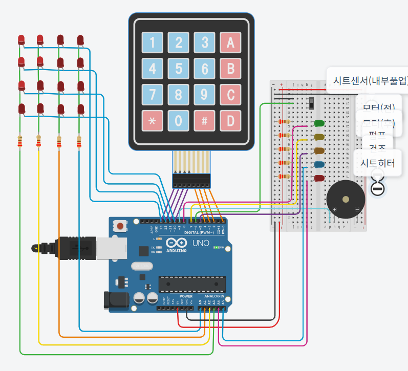

# bidet (AVR FSM Bidet Controller)

ATmega328P(Arduino UNO)에서 **AVR 레지스터 기반 C**로 키패드/시트센서 입력을 받아  
노즐 시퀀스 + 펌프 PWM + 건조팬/시트히터/버저를 제어하는 **비데 동작 제어(FSM)** 프로젝트입니다.

---

## 프로젝트 요약

| 항목 | 내용 |
|---|---|
| 기간 / 인원 | 약 1개월 / 3명 |
| 역할 | 팀 리더, 전체 초기화·제어 로직 및 펌웨어 구현 중심 |
| 핵심 키워드 | AVR Register C, FSM(상태머신), PWM, UART Log, Timer ISR |
| 코드 | `bidet.c` |
| 자료 | `비데.pdf`(회로), `keymap.PNG`(키맵), `상태default.PNG`(구성) |

---

## Demo / Circuit

- Tinkercad Simulation: https://www.tinkercad.com/things/dAJD8LZWQTw-copy-of-millis/editel?returnTo=https%3A%2F%2Fwww.tinkercad.com%2Fdashboard
- Circuit PDF: `비데.pdf`
- Keymap Image: `keymap.PNG`
- Wiring / Setup Image: `상태default.PNG`
- ## Screenshots

(1) DEFAULT

(2) Seat ON / Nozzle Lv2 / Pressure Lv1 / Seat Heat Lv2

---

## 주요 기능

- **FSM 기반 시퀀스 제어**: IDLE → 노즐 전진 → 펌프 분사 → 노즐 복귀 → 약수압 → 건조 → IDLE
- **펌프 PWM 제어**: 듀티 기반 수압 단계 제어
- **UART TX 로깅(9600bps)**: 상태/이벤트 로그 출력
- **Timer0 기반 시간관리**: overflow ISR 기반 시간 함수
- **Timer1 기반 버저 톤**: 동작/정지 이벤트 피드백

---

## 펌웨어 구조(요약)

- `bidet.c`
  - Timer0 시간관리(시간 함수/지연)
  - UART TX(9600bps) 로깅
  - tone/버저(Timer1)
  - LED 매트릭스, 키패드 매트릭스 스캔
  - FSM: `enter_state()`, `update_state()` 중심

---

## FSM 상태 정의

- `IDLE`
- `NOZZLE_FORWARD`
- `PUMP_ON`
- `NOZZLE_BACK`
- `PUMP_WEAK`
- `DRY`

---

## FSM 전이표(요약)

| Current State | Transition Condition | Next State |
|---|---|---|
| NOZZLE_FORWARD | 경과시간 >= 노즐 전진 시간 | PUMP_ON |
| PUMP_ON | 경과시간 >= 5000ms | NOZZLE_BACK |
| NOZZLE_BACK | 경과시간 >= 노즐 복귀 시간 && stop_requested==1 | IDLE |
| NOZZLE_BACK | 경과시간 >= 노즐 복귀 시간 && stop_requested==0 | PUMP_WEAK |
| PUMP_WEAK | stop_requested==1 | IDLE |
| PUMP_WEAK | 경과시간 >= 1000ms && stop_requested==0 | DRY |
| DRY | stop_requested==1 OR 경과시간 >= 3000ms | IDLE |

---

## 트러블슈팅(재현–원인–해결–검증)

- 재현: 펌프 PWM 듀티 변경 시 LED 밝기에도 영향 발생
- 원인: 제어 경로 간 변수명 중복으로 동일 변수를 참조/오염
- 해결: 변수/스코프 정리 및 관련 코드 재작성(출력 모듈 분리)
- 검증: 펌프 듀티 변경과 LED 제어가 독립적으로 동작함 확인

---

## References (근거/검증용)

- Source Code: `bidet.c`
  - https://raw.githubusercontent.com/sehoon0103/bidet/main/bidet.c
- Repository Files
  - https://github.com/sehoon0103/bidet/tree/main
- Circuit PDF
  - https://github.com/sehoon0103/bidet/blob/main/%EB%B9%84%EB%8D%B0.pdf?raw=1
- Keymap Image
  - https://raw.githubusercontent.com/sehoon0103/bidet/main/keymap.PNG
- Wiring / Setup Image
  - https://raw.githubusercontent.com/sehoon0103/bidet/main/%EC%83%81%ED%83%9Cdefault.PNG
- Tinkercad Simulation
  - https://www.tinkercad.com/things/dAJD8LZWQTw-copy-of-millis/editel?returnTo=https%3A%2F%2Fwww.tinkercad.com%2Fdashboard
